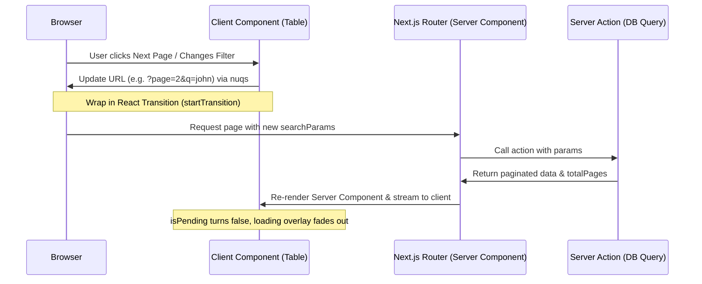

# Admin CMS: Server-Side Pagination & URL-Driven State Pattern

This document describes the standardized architecture and pattern for high-performance server-side pagination, searching, and filtering inside the Admin CMS. Follow this pattern to ensure scalability, shareable URLs, and optimal client-side rendering performance.

---

## 1. Architectural Overview

Admin CMS tables often manage datasets that grow beyond thousands of items. Client-side loading and filtering of these datasets degrade performance and increase initial load times. 

This pattern utilizes **Server-Side Data Retrieval** paired with **URL-Driven State Management** to offload searching, filtering, sorting, and pagination to the database (via Prisma), while ensuring the browser history is kept in sync.



---

## 2. Common Pitfalls & Anti-Patterns

### ❌ The Bidirectional Sync Trap (State + useEffect)
**Anti-Pattern:** Storing page/limit in a local `useState` inside the table, and using a `useEffect` to synchronize changes with the URL.
* **Why it fails:** If the parent container resets the page to `1` (due to search query change), but the child table's local state is still at page `3`, the `useEffect` will trigger, detect a mismatch, and write page `3` *back* to the URL. This overrides filters, causes double-fetching, and creates severe lag/infinite loops.
* **Solution:** Eliminate local pagination state. Derive the pagination values directly from the URL.

### ❌ The Shallow Update Trap (`shallow: true`)
**Anti-Pattern:** Using `useQueryState('key')` with its default options.
* **Why it fails:** By default, `nuqs` updates URL query parameters client-side only (`shallow: true`). While the URL changes, it **does not** trigger a Server Component re-render or refetch data.
* **Solution:** Always declare URL filters with `shallow: false`.

---

## 3. Step-by-Step Implementation Guide

### Step 1: Server Component Configuration
The Server Component acts as the entry point. It receives `searchParams` from the Next.js page Router, invokes the server action, and passes the result down.

```tsx
// app/[locale]/(private)/admin/items/page.tsx
import { ItemsTable } from "./table";
import { getItemsPaginated } from "@/app/[locale]/actions/items";

type SearchParams = Promise<{
  page?: string;
  limit?: string;
  q?: string;
  status?: string;
}>;

export default async function ItemsPage({
  searchParams,
}: {
  searchParams: SearchParams;
}) {
  const params = await searchParams;
  const page = Number(params.page) || 1;
  const limit = Number(params.limit) || 10;
  const q = params.q || "";
  const status = params.status || "ALL";

  // Single query returning the current page data + stats/metadata
  const { data, totalPages, totalCount } = await getItemsPaginated({
    page,
    limit,
    q,
    status,
  });

  return (
    <ItemsTable
      data={data}
      totalPages={totalPages}
      totalCount={totalCount}
    />
  );
}
```

### Step 2: Client Hook Declarations with Transitions
In the client container component, bind your filter inputs and table parameters to the URL using `useQueryState` from `nuqs`. Pass a `startTransition` from React's `useTransition` to observe server loading states.

```tsx
// app/[locale]/(private)/admin/items/table.tsx
"use client";

import { useTransition } from "react";
import { useQueryState } from "nuqs";
import { DataTable } from "@/components/data-table";

export function ItemsTable({ data, totalPages }: ItemsTableProps) {
  const [isPending, startTransition] = useTransition();

  // URL States - Bind to inputs & pass transition callback
  const [search, setSearch] = useQueryState("q", {
    defaultValue: "",
    shallow: false,
    startTransition,
  });
  const [statusFilter, setStatusFilter] = useQueryState("status", {
    defaultValue: "ALL",
    shallow: false,
    startTransition,
  });
  
  // Note: we track the query state page here in the parent so that search
  // inputs or filters can reset page parameter back to 1.
  const [page, setPage] = useQueryState("page", {
    shallow: false,
    startTransition,
  });

  return (
    <div className="relative">
      {/* ── Visual Loading Overlay ────────────────────────────────────── */}
      {isPending && (
        <div className="absolute inset-0 z-10 flex items-center justify-center bg-background/50 backdrop-blur-[1px] rounded-lg transition-all duration-300">
          <div className="flex flex-col items-center gap-2">
            <div className="h-8 w-8 animate-spin rounded-full border-4 border-primary border-t-transparent" />
            <span className="text-xs text-muted-foreground font-medium animate-pulse">
              Đang tải dữ liệu...
            </span>
          </div>
        </div>
      )}

      {/* Dim container while transition is pending */}
      <div className={isPending ? "opacity-60 pointer-events-none transition-opacity" : "transition-opacity"}>
        <DataTable
          columns={columns}
          data={data}
          pageCount={totalPages}
        />
      </div>
    </div>
  );
}
```

### Step 3: Pure-Functional DataTable Pagination Sync
Within the generic `DataTable` component, do **not** use local component state to store the page or limit. Instead:
1. Parse the page and limit parameters directly from `nuqs`.
2. Construct the table pagination state on-the-fly using `useMemo`.
3. Provide an `onPaginationChange` handler that translates React Table updaters into URL query parameter updates.

```tsx
// components/data-table.tsx
"use client";

import * as React from "react";
import { useQueryState, parseAsInteger } from "nuqs";
import { useReactTable, type PaginationState, type Updater } from "@tanstack/react-table";

export function DataTable<TData, TValue>({
  columns,
  data,
  pageCount,
}: DataTableProps<TData, TValue>) {
  // Read params with non-shallow option to bubble up updates
  const [page, setPage] = useQueryState(
    "page",
    parseAsInteger.withOptions({ shallow: false }).withDefault(1),
  );
  const [limit, setLimit] = useQueryState(
    "limit",
    parseAsInteger.withOptions({ shallow: false }).withDefault(10),
  );

  // 1. Memoize pagination state from URL
  const pagination = React.useMemo(
    () => ({
      pageIndex: page - 1,
      pageSize: limit,
    }),
    [page, limit],
  );

  // 2. Functional state updater
  const handlePaginationChange = React.useCallback(
    (updater: Updater<PaginationState>) => {
      const nextValue =
        typeof updater === "function" ? updater(pagination) : updater;

      const newPage = nextValue.pageIndex + 1;
      if (page !== newPage) {
        // setting to null removes parameter from URL, defaulting back to 1
        setPage(newPage > 1 ? newPage : null);
      }
      if (limit !== nextValue.pageSize) {
        // setting to null removes parameter from URL, defaulting back to 10
        setLimit(nextValue.pageSize !== 10 ? nextValue.pageSize : null);
      }
    },
    [pagination, page, limit, setPage, setLimit],
  );

  const isServerSide = pageCount !== undefined;

  const table = useReactTable({
    data,
    columns,
    manualPagination: isServerSide,
    pageCount: isServerSide ? pageCount : undefined,
    state: {
      pagination,
      // other states (sorting, columnFilters)
    },
    onPaginationChange: handlePaginationChange,
    // other configuration
  });

  return (
    // Render your table and navigation controls
  );
}
```

---

## 4. Key Benefits

1. **Instant URL Sharing**: Users can copy the URL at any time (e.g. `admin/items?page=3&status=ACTIVE&q=hello`) and send it to other administrators. The table will instantly load in the identical state.
2. **Zero Local Pagination State Overhead**: Fully removes state synchronizers (`useEffect`), preventing racing conditions, loops, and visual lag.
3. **Transition-Aware Indicators**: Avoids empty white-screen states during loading. The table remains interactive/visible but is blurred and overlaid with a high-fidelity spinner while data is being fetched.
